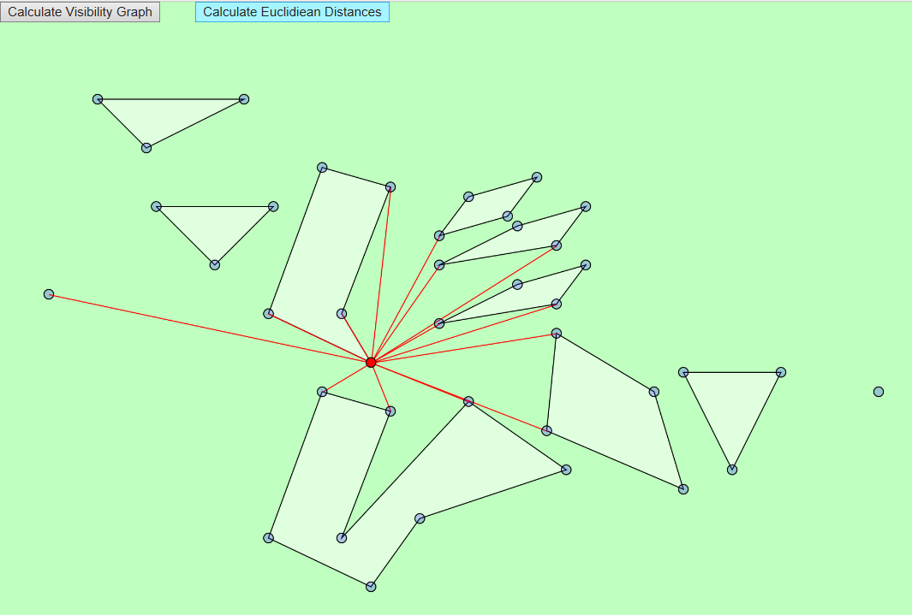

# Shortest path among obstacles

JavaScript solution to the problem of a shortest path among obstacles for a point robot. Detailed problem description can be found in the book **Computational Geometry - Algorithms and Applications** by Mark de Berg, Otfried Cheong, Marc van Kreveld and Mark Overmars. p5.js library used for visualization.

## Problem statement

Given a set of disjoint polygons, a start point p, and an end point q, compute the shortest path between p and q that does not enter into the interior of any polygon. 

*Upper bounds*: O(n2 * log n) time, where n is the total number of edges in the obstacles.

## Solution

It is clear (and it can be shown) that the shortest path will definitely comprise of only the points p and q and some of the vertices of the polygons (if any). That means that we will move only from one vertex of a polygon to another (and the points p and q). Based on this conclusion, our plan is to make a map of roads in our plane, more precisely a map on which we will have roads between points that "see" each other (are visible to one another, a line can be drawn that does not intersect any polygon). This map is called the Visibility Graph. It is an undirected graph (because if one point "sees" another, the same applies the other way around) where the vertices are the vertices of the polygons and p and q, and the edges are the edges of visibility, in other words, two vertices are connected if they "see" each other. It is important to note that two vertices of the same polygon always "see" each other. When we set the problem like this, it is clear that our solution is a subset of the Visibility Graph. Based on that, we come to this algorithm:

**ShortestPath(S, Pstart, Pgoal)**  
*Input* - S is the set of polygons (obstacles), Pstart is the starting point, Pgoal is the end point  
*Output* - The shortest path and its length
1. Calculate Visibility Graph
2. Add a weight to each edge of the graph, the weight corresponds to the Euclidean distance between the points
3. Use some well known algorithm for shortest paths, such as Dijkstra's algorithm and return the found path

It turns out that the complexity of thjis algorithm is O(n2 * log n), where n is the total number of edges in the obstacles (not the number of edges in the Visibility Graph, which can be larger). This complexity comes from the calculation of the Visibility Graph and we will describe it's implementation. We assume that steps 2 and 3 mentioned above are well known. The number of edges in the Visibility Graph is bound by (n + 2) over two = n2 (if the Visibility Graph is a complete graph). That means that the algorithm from step 2 will work in O(n2), as well as Dijkstra's algorithm which works in O((n + k) * log n), where k is the number of edges, in other words k = O(n2) (there are actually more efficient ways of implementing Dijkstra's algorithm using Fibonacci heaps, but we won't bother here since the overall complexity is O(n2 * log n)).

Next, we describe the Visibility Graph algorithm:

**VisibilityGraph(S)**  
*Input* - S is the set of polygons  
*Output* - Visibility graph
1. Initialize a graph G = (V, E), where V (vertices) is the set of all vertices of S, and E (edges) is and empty set
2. for v in V do
3. &nbsp;&nbsp;&nbsp;&nbsp;&nbsp;&nbsp;W = VisibleVertices(v, S)
4. &nbsp;&nbsp;&nbsp;&nbsp;&nbsp;&nbsp;For each vertex w from W, add an edge (v,w) to E
5. return G

Here, the function VisibleVertices return all the vertices from set S which are visible from vertex v. For each such vertex we add an edge to the Visibility Graph.

If we want to check only for one vertex w from S whether or not it is visible from some vertex p, there is nothing very smart that we can do about it, we have to check if the line p-w intersects any polygon from S by traversing through all the edges of each polygon. If we did it that way for every vertex, the complexity would be O(n3). However, it turns out that the information we gain by testing for one vertex can be used for testing for the others. What is a good way to process the vertices we are checking? The logical way is to test them in some kind of circular order around vertex p. Besides that, we will store a data structure that will help us to efficiently determine the visibility of each next vertex we come across. Vertex w is visible from p if the line p-w does not intersect the interior of any polygon. If we consider the half-line P from vertex p that passes through w, it is clear the if we can't see w from p, that means that the half-line P intersects an edge of a polygon before it reaches w. In order to test if this is the case, we do a binary search over the edges that P intersects (there is also another case where w is not visible, namely when p and w are vertices of the same polytgon and p-w passes through the interior of the polygon, we'll see later how we handle this). So, we process the vertices in circular order, we maintain a balanced binary search tree where we store the edges of polygons that P intersects. The ordering of the tree is as follows: the left-most leaf will be the edge of the polygon which P intersects first. This way, we can easily check whether there is an edge that P intersects before some vertex, we always check the first edge it intersects, the left-most leaf. Notice that because we process the vertices in circular order, we are actually constantly rotating the half-line P. This is like the plane sweep algorithm, the only difference being that this is a circular sweep. Next, we describe the ciruclar sweep:

**VisibleVertices(p,S)**  
*Input* - p is the vertex we are testing for, S is the set of polygons  
*Output* - The set of all obstacle vertices visible from p.
1. Sort the obstacle vertices according to the clockwise angle that the halfline from p to each vertex makes with the positive x-axis. In case of ties, vertices closer to p should come before vertices farther from p
2. Let P be the half-line starting at p, parallel to the positive x-axis. Find the edges of all polygons that P intersects (only the ones that it does not intersect in the vertex of some polygon) and store them in a balanced search tree T in the order in which they are intersected by ρ
3. Initialize W
4. for i = 1 to n do
5. &nbsp;&nbsp;&nbsp;&nbsp;&nbsp;&nbsp;if Visible(wi) then
6. &nbsp;&nbsp;&nbsp;&nbsp;&nbsp;&nbsp;&nbsp;&nbsp;&nbsp;&nbsp;&nbsp;&nbsp;W.add(wi)
7. &nbsp;&nbsp;&nbsp;&nbsp;&nbsp;&nbsp;Insert into T the obstacle edges incident to wi that lie on the clockwise side of the half-line from p to wi
8. &nbsp;&nbsp;&nbsp;&nbsp;&nbsp;&nbsp;Delete from T the obstacle edges incident to wi that lie on the counterclockwise side of the half-line from p to wi.
9. return W

This algorithm represents our circular sweep. The sweep begins from a half-line that it parallel to the positive x-axis and continues in clockwise direction. The function Visible tells us whether or not wi is visible. As we already mentioned, this means a search in T to see if the closes edge to p intersects the line defined p-wi. However, we have to be careful when the line defined p-wi contains other vertices, because the approach we just mentioned can give us the wrong answer. If there is a vertex on  p-wi, it can upset our check. Because of this, we have to be wary of all the vertices that are located on the line defined p-wi that are between p and wi. Luckily, the visibility of such vertices has already been determined in the algorithm, so we can find a way to determined the visibility of wi by looking at them. It is clear that if the vertex wi - 1 is not visible, there is no way we can see vertex wi. On the other hand, if wi - 1 is visible, there are two cases in which wi is not visible: either the whole line wi - 1-wi lies within the polygon of which wi - 1 and wi are vertices of, or the line wi - 1-wi intersects some edge from T. Having this in mind, we get the following function:

**Visible(wi)**  
*Input* - wi is the vertex we are testing  
*Output* - true or false
1. if p-wi intersects the interior of any polygon of which wi is a vertex of
2. &nbsp;&nbsp;&nbsp;&nbsp;&nbsp;&nbsp;return false
3. else
4. &nbsp;&nbsp;&nbsp;&nbsp;&nbsp;&nbsp;if i = 1 or wi - 1 is not on the line p-wi
5. &nbsp;&nbsp;&nbsp;&nbsp;&nbsp;&nbsp;&nbsp;&nbsp;&nbsp;&nbsp;&nbsp;&nbsp;Search in T for the edge e in the leftmost leaf
6. &nbsp;&nbsp;&nbsp;&nbsp;&nbsp;&nbsp;&nbsp;&nbsp;&nbsp;&nbsp;&nbsp;&nbsp;if e exists and p-wi intersects e
7. &nbsp;&nbsp;&nbsp;&nbsp;&nbsp;&nbsp;&nbsp;&nbsp;&nbsp;&nbsp;&nbsp;&nbsp;&nbsp;&nbsp;&nbsp;&nbsp;&nbsp;&nbsp;return false
8. &nbsp;&nbsp;&nbsp;&nbsp;&nbsp;&nbsp;&nbsp;&nbsp;&nbsp;&nbsp;&nbsp;&nbsp;else
9. &nbsp;&nbsp;&nbsp;&nbsp;&nbsp;&nbsp;&nbsp;&nbsp;&nbsp;&nbsp;&nbsp;&nbsp;&nbsp;&nbsp;&nbsp;&nbsp;&nbsp;&nbsp;return true
10. &nbsp;&nbsp;&nbsp;&nbsp;&nbsp;&nbsp;else
11. &nbsp;&nbsp;&nbsp;&nbsp;&nbsp;&nbsp;&nbsp;&nbsp;&nbsp;&nbsp;&nbsp;&nbsp;if wi - 1 is not visible
12. &nbsp;&nbsp;&nbsp;&nbsp;&nbsp;&nbsp;&nbsp;&nbsp;&nbsp;&nbsp;&nbsp;&nbsp;&nbsp;&nbsp;&nbsp;&nbsp;&nbsp;&nbsp;return false
13. &nbsp;&nbsp;&nbsp;&nbsp;&nbsp;&nbsp;&nbsp;&nbsp;&nbsp;&nbsp;&nbsp;&nbsp;else
14. &nbsp;&nbsp;&nbsp;&nbsp;&nbsp;&nbsp;&nbsp;&nbsp;&nbsp;&nbsp;&nbsp;&nbsp;&nbsp;&nbsp;&nbsp;&nbsp;&nbsp;&nbsp;Search in T for an edge e that intersects wi-wi - 1.
15. &nbsp;&nbsp;&nbsp;&nbsp;&nbsp;&nbsp;&nbsp;&nbsp;&nbsp;&nbsp;&nbsp;&nbsp;&nbsp;&nbsp;&nbsp;&nbsp;&nbsp;&nbsp;if e exists
16. &nbsp;&nbsp;&nbsp;&nbsp;&nbsp;&nbsp;&nbsp;&nbsp;&nbsp;&nbsp;&nbsp;&nbsp;&nbsp;&nbsp;&nbsp;&nbsp;&nbsp;&nbsp;&nbsp;&nbsp;&nbsp;&nbsp;&nbsp;&nbsp;return false
17. &nbsp;&nbsp;&nbsp;&nbsp;&nbsp;&nbsp;&nbsp;&nbsp;&nbsp;&nbsp;&nbsp;&nbsp;&nbsp;&nbsp;&nbsp;&nbsp;&nbsp;&nbsp;else
18. &nbsp;&nbsp;&nbsp;&nbsp;&nbsp;&nbsp;&nbsp;&nbsp;&nbsp;&nbsp;&nbsp;&nbsp;&nbsp;&nbsp;&nbsp;&nbsp;&nbsp;&nbsp;&nbsp;&nbsp;&nbsp;&nbsp;&nbsp;&nbsp;return true

This concludes the description of the techniques used. The only thing left is to analyze the complexity of the algorithm VisibleVertices. The time before the for-loop in line 4 i O(n * log n) because of the sorting of the vertices around p. Then, each iteration of the loop also means several (a constant amount) of operations on the balanced binary tree T for which we need O(log n) time, plus some calculations which are constant. Therefore, one iteration of the loop has complexity O(log n), which lead us to the total time of O(n * log n). The algorithm VisibleVertices is called for each of the n vertices of polygons (the number of vertices is the same as the number of edges) so that total time complexity for calculating the Visibility Graph is O(n2 * log n).

## Usage

The app is run in the browser (index.html). The supported browsers are Edge and Mozilla because Chrome does not allow for loading of data from files, which is needed for setting the points and polygons. The starting and end points as well as the polygon obstacles are read from the files points.xml and polygons.xml. It is important to list polygon points in a clockwise or counterclockwise direction (in a consecutive order). 

The algorithm is run in three stages, the first one is calculating the visibility graph.

After that, clicking on a point will highlight all other points visible from it.

The second stage is adding weight to edges in the visibility graph, every edge will have a weight corresponding to the Euclidean distance between the points it connects.

The third and final stage is calculating the shortest path between the start and end point using Dijsktra'a algorithm.

